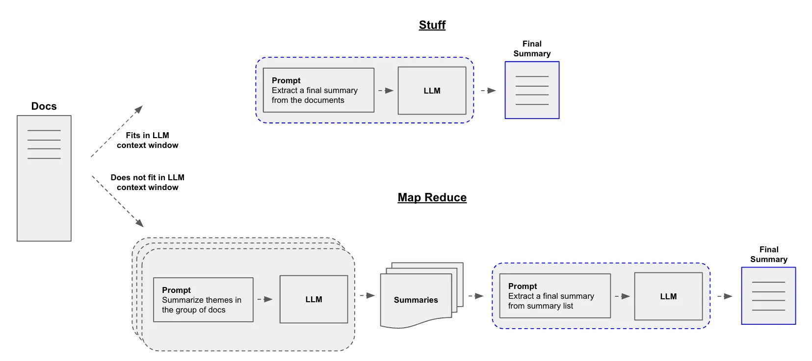

# LLM Text Summarization Techniques

Text summarization in the era of Large Language Models (LLMs) has shifted from simple sentence extraction to sophisticated semantic synthesis. This guide covers the foundational approaches and the modern prompting strategies used to handle various document lengths.

---

## 1. Fundamental Approaches

### Extractive Summarization
This technique involves identifying and "extracting" the most important sentences or phrases directly from the source text. It does not generate new words.
* **Mechanism:** Uses scoring algorithms (like TextRank) or LLM embeddings to find high-value sentences.
* **Best for:** Legal or technical documents where changing the wording could alter the meaning.

### Abstractive Summarization
This technique mimics human behavior by "understanding" the text and rewriting it. The LLM generates entirely new sentences to convey the same meaning.
* **Mechanism:** Uses the model's internal knowledge and linguistic capabilities to paraphrase and condense.
* **Best for:** Creative writing, news articles, and general executive summaries.

---

## 2. Prompting Strategies for Large Documents

When a document exceeds the model's **context window** (the maximum number of tokens it can process at once), specific architectural patterns are required.


### A. Stuffing
The most straightforward method. The entire document is inserted into the prompt in one go.
* **Pros:** Cheap and fast (only one API call). The model has full context.
* **Cons:** Limited by the model's context window; performance can degrade on very long prompts ("Lost in the Middle" phenomenon).

The StuffDocumentsChain represents the most basic form of text summarization method in LangChain. As it sounds, it “stuffs” the entire document into a single prompt and asks the LLM to generate a summary.

Let’s implement it using the speech from the previous section:

```
from PyPDF2 import PdfReader
from langchain.docstore.document import Document
from langchain.chains.summarize import load_summarize_chain
from langchain.prompts import PromptTemplate

# Function to read PDF
def read_pdf(file_path):
    pdfreader = PdfReader(file_path)
    text = ''
    for i, page in enumerate(pdfreader.pages):
        content = page.extract_text()
        if content:
            text += content
    return text

# Uncomment this line to use actual PDF file
# text = read_pdf('speech.pdf')

# For demonstration, let's use the speech text instead
text = speech
docs = [Document(page_content=text)]

template = (
    "Write a concise and short summary of the following speech.\n"
    "Speech: `{text}`"
)

prompt = PromptTemplate(
    input_variables=['text'],
    template=template
)

chain = load_summarize_chain(
    llm,
    chain_type='stuff',
    prompt=prompt,
    verbose=False
)

output_summary = chain.run(docs)
print(output_summary)

```

### B. Map-Reduce
A multi-stage process for massive datasets.
1.  **Map:** The document is split into chunks. Each chunk is summarized independently.
2.  **Reduce:** All chunk summaries are combined into a final "master" summary.
* **Pros:** Can handle documents of infinite length (e.g., entire libraries).
* **Cons:** Can lose "global" context because the model never sees the whole text at once.

For longer documents that exceed the LLM’s context window, the MapReduceDocumentsChain offers an effective solution. This technique applies a divide-and-conquer approach by:

Splitting the document into smaller chunks
Summarizing each chunk independently (Map)
Combining these summaries into a final summary (Reduce)
To implement MapReduce, let’s import the text splitter, which helps to break the document into sizeable chunks before it is summarized according to the user prompt:

```
from langchain.text_splitter import RecursiveCharacterTextSplitter
from langchain.chains.summarize import load_summarize_chain
from langchain.prompts import PromptTemplate

# Split text into chunks
text_splitter = RecursiveCharacterTextSplitter(
    chunk_size=2000,
    chunk_overlap=100
)
chunks = text_splitter.create_documents([text])

# Define custom prompts
map_prompt = PromptTemplate(
    input_variables=["text"],
    template="Summarize this content:\n{text}"
)

combine_prompt = PromptTemplate(
    input_variables=["text"],
    template="Combine these summaries into a coherent summary:\n{text}"
)

# Create and run the chain
chain = load_summarize_chain(
    llm,
    chain_type="map_reduce",
    map_prompt=map_prompt,
    combine_prompt=combine_prompt,
    verbose=True
)

summary = chain.run(chunks)
print(summary)

```



### C. Refine
An iterative approach where the model "updates" its understanding as it reads.
1.  Summarize Chunk A.
2.  Pass the summary of Chunk A + Chunk B to the model to create a "refined" summary.
3.  Repeat until the end.
* **Pros:** Better at maintaining a narrative flow than Map-Reduce.
* **Cons:** Very slow, as each step depends on the previous one (cannot be processed in parallel).

---

## 3. Advanced Optimization Techniques

### Chain of Density (CoD)
A prompting framework designed to make summaries more "information-dense" without increasing length. The model iteratively adds missing entities (names, dates, specific facts) to a summary while keeping the word count roughly the same.

### Query-Focused Summarization
Instead of a generic summary, the model is instructed to summarize the text through a specific lens.
* **Example:** "Summarize this medical paper focusing only on the side effects of the drug."

---

## 4. Evaluation Metrics

How do we know if a summary is good?
* **ROUGE:** Measures the overlap of n-grams between the AI summary and a human-written reference.
* **BERTScore:** Uses embeddings to measure semantic similarity (better for abstractive summaries).
* **G-Eval:** Using a more powerful LLM (like GPT-4o) to grade the summary of a smaller model based on coherence and relevance.